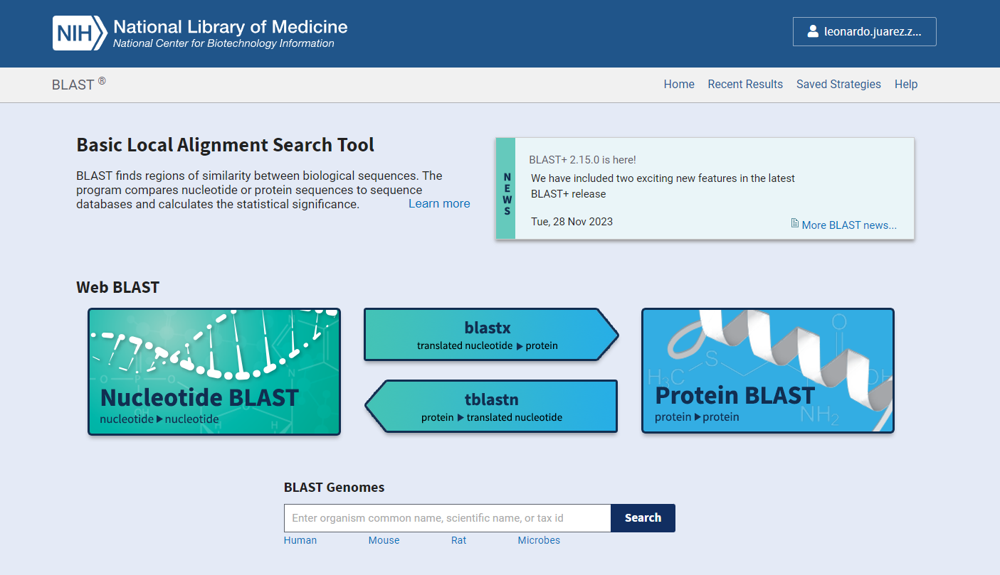
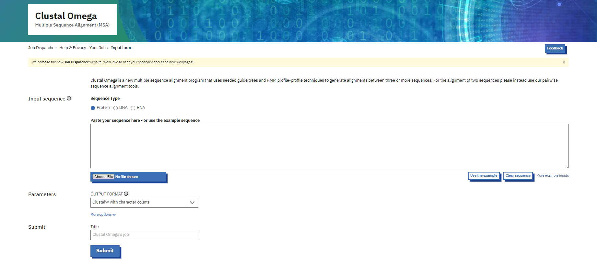
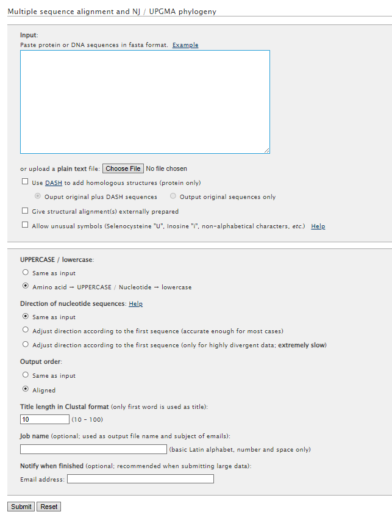
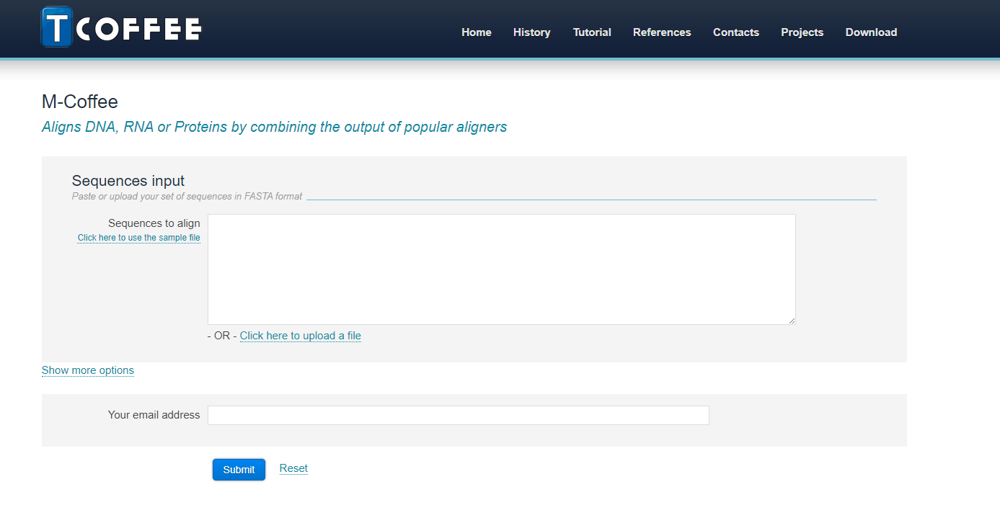
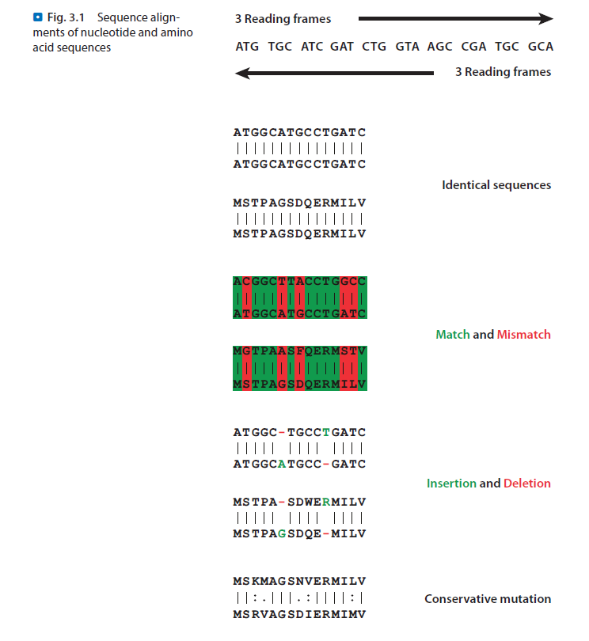
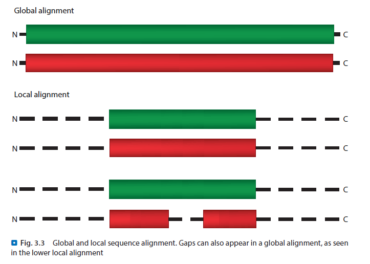

# Alineamiento de secuencias

El alineamiento de secuencias es una técnica que se utiliza para comparar dos o más secuencias de ADN o proteínas. Esta técnica se utiliza para determinar la similitud entre las secuencias y para identificar regiones conservadas.

Esta es una de las herramientas más básicas y fundamentales en bioinformática, ya que nos permite comparar secuencias de ADN o proteínas y determinar su similitud. El alineamiento de secuencias es una técnica que se utiliza en una amplia variedad de aplicaciones, como la identificación de genes.

### Tipos de alineamiento

Las herramientas de alineamiento de secuencias son fundamentales en el campo de la bioinformática, ya que permiten comparar y analizar secuencias de ADN, ARN y proteínas para identificar similitudes, diferencias y relaciones evolutivas. A continuación, se presenta una descripción detallada de las principales herramientas de alineamiento de secuencias, los algoritmos que utilizan, y sus ventajas y desventajas.

#### BLAST (Basic Local Alignment Search Tool)
   Descripción y uso:
   BLAST es una de las herramientas más utilizadas para el alineamiento de secuencias. Permite buscar rápidamente similitudes entre una secuencia de consulta y una base de datos de secuencias. Existen varias versiones de BLAST, incluyendo BLASTn para secuencias de nucleótidos, BLASTp para secuencias de proteínas, BLASTx, tBLASTn y tBLASTx para alineamientos entre secuencias de nucleótidos y proteínas.

Algoritmo:
BLAST utiliza un algoritmo de alineamiento local. Se basa en identificar fragmentos de la secuencia de consulta (palabras) que coinciden exactamente con fragmentos en la base de datos. Posteriormente, estos fragmentos se extienden en ambas direcciones para encontrar regiones de mayor similitud. BLAST utiliza una puntuación basada en matrices de sustitución (como BLOSUM o PAM) y penalizaciones por apertura y extensión de brechas.

Ventajas:

- Rápido y eficiente, adecuado para búsquedas en grandes bases de datos.
- Amplia disponibilidad y fácil de usar, con interfaces web y de línea de comandos.
- Permite la comparación tanto de secuencias de nucleótidos como de proteínas.

Desventajas:

- No siempre encuentra el mejor alineamiento global.
- Menos sensible para detectar similitudes distantes debido a su enfoque en alineamientos locales.

{thumbnail="true"}

#### Clustal Omega
   Descripción y uso:
   Clustal Omega es una herramienta para el alineamiento múltiple de secuencias (MSA). Es ampliamente utilizada para alinear secuencias de proteínas y ADN para identificar regiones conservadas y construir árboles filogenéticos.

Algoritmo:
Clustal Omega emplea un enfoque de alineamiento progresivo. Inicialmente, se calcula una matriz de distancias basada en alineamientos pareados rápidos. Luego, se construye un árbol guía (guide tree) mediante el método de agrupamiento jerárquico (neighbor-joining). Las secuencias se alinean progresivamente según el orden determinado por el árbol guía, combinando alineamientos parciales en cada paso.

Ventajas:

- Eficiente para alinear múltiples secuencias.
- Genera alineamientos de alta calidad para secuencias relacionadas evolutivamente.
- Maneja bien grandes conjuntos de secuencias.
Desventajas:

- El enfoque progresivo puede ser sensible a errores en los pasos iniciales, lo que puede afectar el alineamiento final.
- Menos efectivo para secuencias con baja similitud.

{thumbnail="true"}

#### MAFFT (Multiple Alignment using Fast Fourier Transform)
   Descripción y uso:
   MAFFT es otra herramienta popular para el alineamiento múltiple de secuencias. Es conocida por su rapidez y precisión, y es adecuada para secuencias de ADN y proteínas.

Algoritmo:
MAFFT utiliza una combinación de métodos, incluyendo el uso de la transformada rápida de Fourier (FFT) para acelerar el cálculo de alineamientos iniciales. Luego, emplea métodos progresivos y de iteración para refinar los alineamientos. MAFFT ofrece varios modos de alineamiento, desde rápidos y menos precisos hasta más lentos y más precisos, permitiendo al usuario equilibrar velocidad y precisión según sus necesidades.

Ventajas:

- Muy rápido, especialmente en modos rápidos.
- Flexible, con múltiples modos de alineamiento.
- Alta precisión, especialmente en modos iterativos. 

Desventajas:

- Los modos más precisos pueden ser lentos para grandes conjuntos de secuencias.
- La elección del modo adecuado puede ser compleja para usuarios novatos.

{thumbnail="true"}

#### MUSCLE (MUltiple Sequence Comparison by Log-Expectation)
   Descripción y uso:
   MUSCLE es otra herramienta para el alineamiento múltiple de secuencias, conocida por su equilibrio entre rapidez y precisión. Se utiliza ampliamente para secuencias de proteínas y ADN.

Algoritmo:
MUSCLE también emplea un enfoque progresivo, pero con refinamientos adicionales. Inicialmente, construye un árbol guía usando un método de agrupamiento basado en UPGMA o neighbor-joining. Después de los alineamientos iniciales, realiza iteraciones para refinar el alineamiento utilizando expectativas logarítmicas para evaluar la calidad del alineamiento.

Ventajas:

- Buen equilibrio entre rapidez y precisión.
- Produce alineamientos de alta calidad.
- Iterativo, mejorando progresivamente la calidad del alineamiento.

Desventajas:

- Puede ser más lento que otros métodos rápidos para grandes conjuntos de secuencias.
- El proceso iterativo puede ser computacionalmente intensivo.

{thumbnail="true"}

#### T-Coffee (Tree-based Consistency Objective Function For alignment Evaluation)
   Descripción y uso:
   T-Coffee es una herramienta para el alineamiento múltiple de secuencias que enfatiza la coherencia entre los alineamientos pareados. Es utilizada tanto para secuencias de proteínas como de ADN.

Algoritmo:
T-Coffee emplea un enfoque de alineamiento progresivo, pero con un paso inicial adicional que combina información de múltiples fuentes (incluyendo otros alineamientos) para generar una biblioteca de fragmentos alineados. Luego, utiliza esta biblioteca para guiar el alineamiento progresivo, asegurando la coherencia entre alineamientos pareados.

Ventajas:

- Alta precisión debido a la combinación de información de múltiples fuentes.
- Versátil, compatible con otros programas de alineamiento.
- Útil para secuencias con baja similitud.
Desventajas:

- Puede ser más lento que otras herramientas debido a su enfoque detallado.
- Requiere más recursos computacionales.

{thumbnail="true"}

### Trabajando con alineamientos

Cuando se trabaja con alineamientos de secuencias, es importante saber que pueden producirse diferentes fenomenos en la alineación de secuencias. Algunos de estos fenomenos incluyen:

- Secuencias idénticas: Dos secuencias que son exactamente iguales.
- Matches: Pares de nucleótidos o aminoácidos que son iguales en las dos secuencias.
- Mismatches: Pares de nucleótidos o aminoácidos que son diferentes en las dos secuencias.
- Inserciones/Deleciones (gaps): Regiones en las que una secuencia tiene un nucleótido o aminoácido adicional o falta uno en comparación con la otra secuencia.
- Conservación: Regiones en las que los nucleótidos o aminoácidos son similares entre las secuencias, indicando una posible función o estructura conservada.

{thumbnail="true"}
Imagen obtenida del libro "Applied Bioinformatics de Paul M. Selzer"

### Alineamiento global vs. local

Existen dos enfoques principales para el alineamiento de secuencias: global y local. En el alineamiento global, se busca el mejor alineamiento entre dos secuencias en toda su longitud, lo que puede resultar en la identificación de regiones conservadas y divergentes. En el alineamiento local, se busca el mejor alineamiento en una región específica de las secuencias, lo que puede ser útil para identificar dominios conservados o regiones de interés.

El alineamiento global es útil para comparar secuencias completas y determinar su similitud general, mientras que el alineamiento local es útil para identificar regiones conservadas o similares en secuencias que pueden ser muy diferentes en su totalidad.

{thumbnail="true"}

### Algoritmos de alineamiento de secuencias

Los algoritmos de alineamiento de secuencias son fundamentales para la bioinformática y se utilizan en una amplia variedad de aplicaciones, como la identificación de genes, la comparación de secuencias evolutivas y la predicción de estructuras de proteínas. Algunos de los algoritmos de alineamiento de secuencias más comunes incluyen:

- Needleman-Wunsch: Un algoritmo de programación dinámica que encuentra el mejor alineamiento global entre dos secuencias.
- Smith-Waterman: Un algoritmo de programación dinámica que encuentra el mejor alineamiento local entre dos secuencias.
- FASTA: Un algoritmo heurístico que encuentra alineamientos locales rápidos entre secuencias.
- BLAST: Un algoritmo heurístico que encuentra alineamientos locales rápidos entre secuencias utilizando una base de datos de secuencias.
- Gapped BLAST: Una versión de BLAST que permite la inserción de gaps en los alineamientos.

### Conclusiones

Como podemos ver existe una gran variedad de herramientas y algoritmos para realizar alineamientos de secuencias. Cada una de estas herramientas tiene sus propias ventajas y desventajas, y es importante elegir la herramienta adecuada para el tipo de secuencias que estamos analizando y los objetivos de nuestro estudio. El alineamiento de secuencias es una técnica fundamental en bioinformática y nos permite comparar secuencias de ADN y proteínas para identificar similitudes, diferencias y relaciones evolutivas.

