# Bioinformatica 101

## Los Fundamentos biologicos de la Bioinformatica

### Los ácidos nucleicos y las proteínas

Los ácidos nucleicos son moléculas biológicas que se encargan de almacenar y transmitir la información genética de los seres vivos. Estos están formados por nucleótidos,
los cuales son moléculas compuestas por un azúcar, un grupo fosfato y una base nitrogenada. Se dividen en dos tipos: el ADN y el ARN.

El ADN es la macromolécula que se encarga de almacenar la información genética de los seres vivos. Está formado por una doble cadena de nucleótidos que se enrollan en forma de una doble hélice.

El ARN está encargado de la biosíntesis de proteínas que controla el proceso celular. Se diferencia del ADN en que es una sola cadena de nucleótidos y que en lugar de tener la base nitrogenada Timina(T), tiene Uracilo(U).

La estructura de los nucleótidos es la misma en todos los seres vivos, pero la secuencia de estos nucleótidos es lo que determina la información de cada organismo. Específicamente consisten en una pentosa, un residuo de fosfato y una base nitrogenada heterocíclica.

Cada unidad de la estructura básica de residuo de ribosa/ácido fosfórico lleva una base nucleica heterocíclica que está conectada al residuo de azúcar mediante un enlace N-glucosídico. Los ácidos nucleicos consisten en cinco bases diferentes (citosina, uracilo, timina, adenina y guanina), de las cuales el uracilo se encuentra solo en el ARN y la timina solo en el ADN. Los nucleótidos pueden abreviarse usando la primera letra de la base correspondiente, y su sucesión indica la secuencia de nucleótidos de la cadena de ácido nucleico. ADN y ARN no solo difieren en sus bases, sino que los residuos de azúcar respectivos también difieren en composición química. En el ARN, el azúcar es una ribosa, mientras que en el ADN se incorpora 2-desoxirribosa.

El ADN consiste en dos cadenas de nucleótidos que se combinan en una orientación antiparalela, de modo que se forman enlaces de hidrógeno entre las bases de cada cadena, resultando en una estructura similar a una escalera. Las bases están emparejadas de manera que un anillo de purina en una cadena interactúa con un anillo de pirimidina en la cadena opuesta. Existen dos enlaces de hidrógeno entre A y T y tres entre G y C. Las dos cadenas de nucleótidos que componen el ADN son "complementarias" entre sí. Por lo tanto, la sucesión secuencial de bases en una cadena determina la secuencia de bases en la otra cadena.

En condiciones fisiológicas, el ADN existe como una doble hélice en la cual las dos cadenas de polinucleótidos se enrollan hacia la derecha alrededor de un eje común. El diámetro de la doble hélice es de 2 nm. A lo largo de la doble hélice, las bases opuestas están separadas por 0.34 nm y rotadas en un ángulo de 36° entre sí. La estructura helicoidal se repite cada 3.4 nm y corresponde a 10 pares de bases[1]

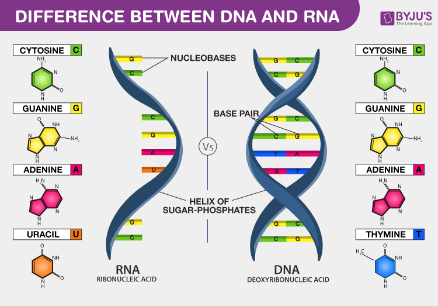{thumbnail="true"}{ width=450 height=300}
Imagen obtenida de [Byjus](https://byjus.com/biology/difference-between-dna-and-rna/)

El ADN consiste de 4 nucleótidos, Adenina(A), Timina(T), Citosina(C) y Guanina(G). Estos nucleótidos se unen mediante enlaces de hidrógeno de la siguiente manera: Adenina se une con Timina y Citosina se une con Guanina. La secuencia de estos nucleótidos es lo que determina la información genética de un organismo.

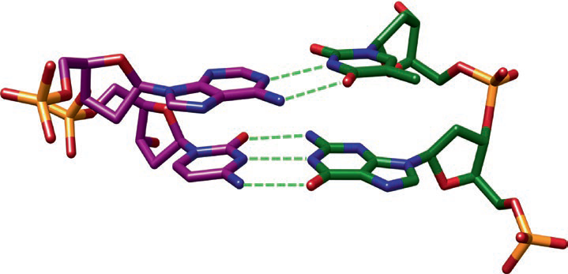{thumbnail="true"}{ width=450 height=300}

Las proteinas son macromoléculas que están formadas por aminoácidos. Existen 20 aminoácidos que se unen mediante enlaces peptídicos para formar las proteínas.

Los aminoácidos son moléculas que contienen un grupo amino (-NH2) y un grupo carboxilo (-COOH). Además, contienen un grupo R que es diferente en cada aminoácido. Este grupo R es el que determina la estructura y función de cada aminoácido.

|   Aminoácido    | Abreviatura |           Codones            |                 Estructura                  |
|:---------------:|:-----------:|:----------------------------:|:-------------------------------------------:|
|     Alanina     |     Ala     |      GCU, GCC, GCA, GCG      |      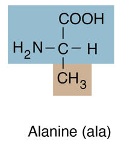      |
|    Arginina     |     Arg     | CGU, CGC, CGA, CGG, AGA, AGG |     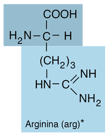     |
|   Asparagina    |     Asn     |           AAU, AAC           |   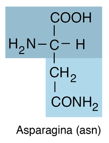   |
| Ácido aspártico |     Asp     |           GAU, GAC           |    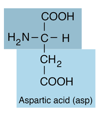    |
|    Cisteina     |     Cys     |           UGU, UGC           |     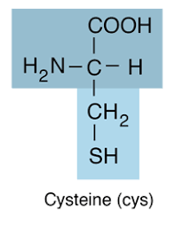     |
|    Glutamina    |     Gln     |           CAA, CAG           |    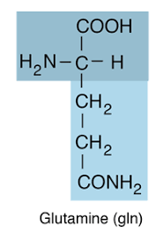    |
| Ácido glutámico |     Glu     |           GAA, GAG           |    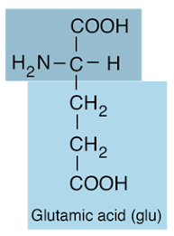    |
|     Glicina     |     Gly     |      GGU, GGC, GGA, GGG      |      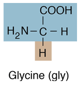      |
|    Histidina    |     His     |           CAU, CAC           |    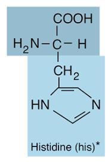    |
|   Isoleucina    |     Ile     |        AUU, AUC, AUA         |   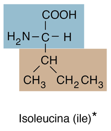   |
|     Leucina     |     Leu     | UUA, UUG, CUU, CUC, CUA, CUG |      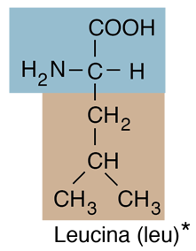      |
|     Lisina      |     Lys     |           AAA, AAG           |       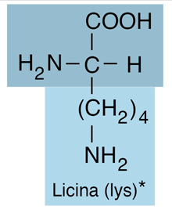       |
|    Metionina    |     Met     |             AUG              |    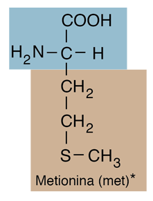    |
|  Fenilalanina   |     Phe     |           UUU, UUC           | 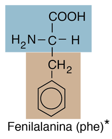 |
|     Prolina     |     Pro     |      CCU, CCC, CCA, CCG      |      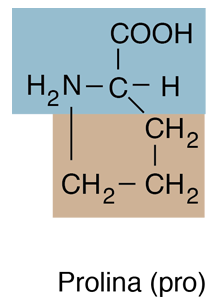      |
|     Serina      |     Ser     | UCU, UCC, UCA, UCG, AGU, AGC |       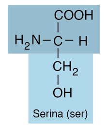       |
|    Treonina     |     Thr     |      ACU, ACC, ACA, ACG      |     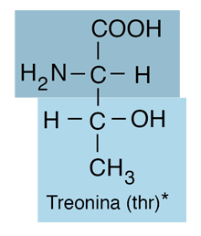     |
|   Triptófano    |     Trp     |             UGG              |   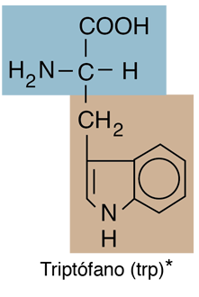   |
|    Tirosina     |     Tyr     |           UAU, UAC           |     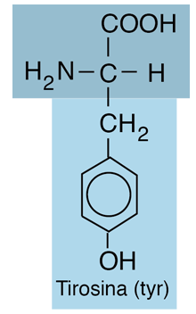     |
|     Valina      |     Val     |      GUU, GUC, GUA, GUG      |       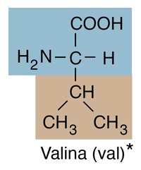       |

Las proteínas son esenciales para la vida de los seres vivos, ya que son las encargadas de realizar la mayoría de las funciones biológicas. Estas funciones incluyen la catálisis de reacciones químicas, la replicación del ADN, la respuesta inmune, el transporte de oxígeno, entre otras.

### El código genético

El código genético es el conjunto de reglas que determina cómo se traduce la información genética del ADN en proteínas. Cada triplete de nucleótidos (codón) codifica para un aminoácido específico.

El código genético es universal, es decir, es el mismo para todos los seres vivos. Sin embargo, existen algunas excepciones a esta regla.

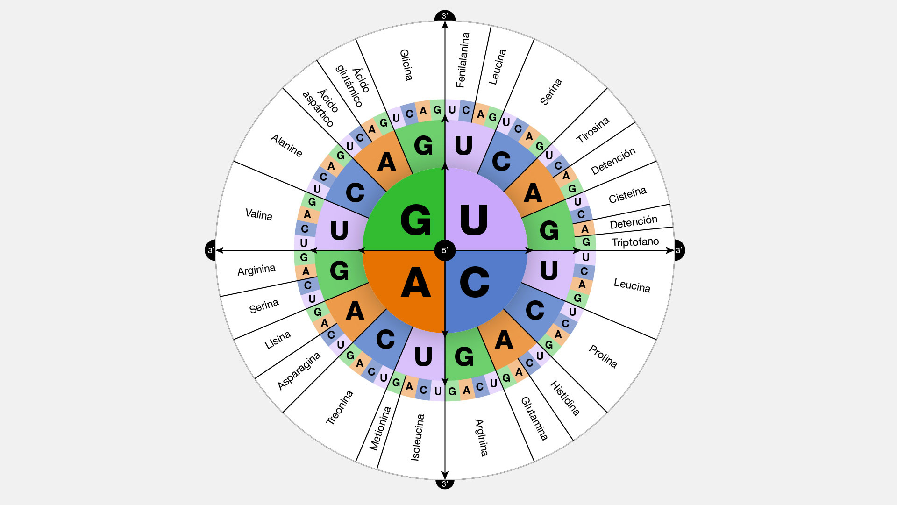{thumbnail="true"}{ width=450 height=300}

<video src="https://youtu.be/tFN8tk_Rx4Q?si=oKZFMeM8uPly_7Lh"/>
### La expresión genética

La expresión genética es el proceso por el cual la información genética del ADN se utiliza para producir proteínas. Este proceso se divide en dos etapas: la transcripción y la traducción.

La transcripción es el proceso por el cual se copia la información genética del ADN en una molécula de ARN. La traducción es el proceso por el cual la información genética del ARN se utiliza para producir una proteína.

## La Bioinformatica en accion

### Análisis de secuencias

El análisis de secuencias es una de las áreas más importantes de la bioinformatica. Este análisis se encarga de estudiar las secuencias de ADN y proteínas para determinar su función, estructura y evolución.

### Alineamiento de secuencias

El alineamiento de secuencias es una técnica que se utiliza para comparar dos o más secuencias de ADN o proteínas. Esta técnica se utiliza para determinar la similitud entre las secuencias y para identificar regiones conservadas.

### Búsqueda de secuencias

La búsqueda de secuencias es una técnica que se utiliza para encontrar secuencias de ADN o proteínas en bases de datos. Esta técnica se utiliza para identificar genes, proteínas y otras moléculas biológicas.

### Análisis de expresión genética

El análisis de expresión genética es una técnica que se utiliza para estudiar la expresión de genes en diferentes condiciones. Esta técnica se utiliza para identificar genes que están involucrados en enfermedades, para estudiar el desarrollo de los organismos y para comprender la respuesta de los organismos a los estímulos ambientales.

### Modelado de proteínas

El modelado de proteínas es una técnica que se utiliza para predecir la estructura tridimensional de las proteínas. Esta técnica se utiliza para comprender la función de las proteínas y para diseñar nuevas proteínas.

## Aplicaciones de la Bioinformatica

### Medicina

La bioinformatica se utiliza en medicina para el diagnóstico de enfermedades, el desarrollo de nuevos fármacos y la medicina personalizada.

### Agricultura

La bioinformatica se utiliza en agricultura para mejorar los cultivos, para desarrollar nuevas variedades de plantas y para controlar las plagas.

### Medio ambiente

La bioinformatica se utiliza en medio ambiente para estudiar la biodivers
