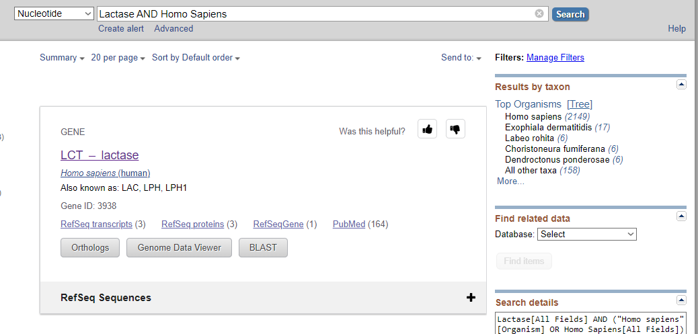
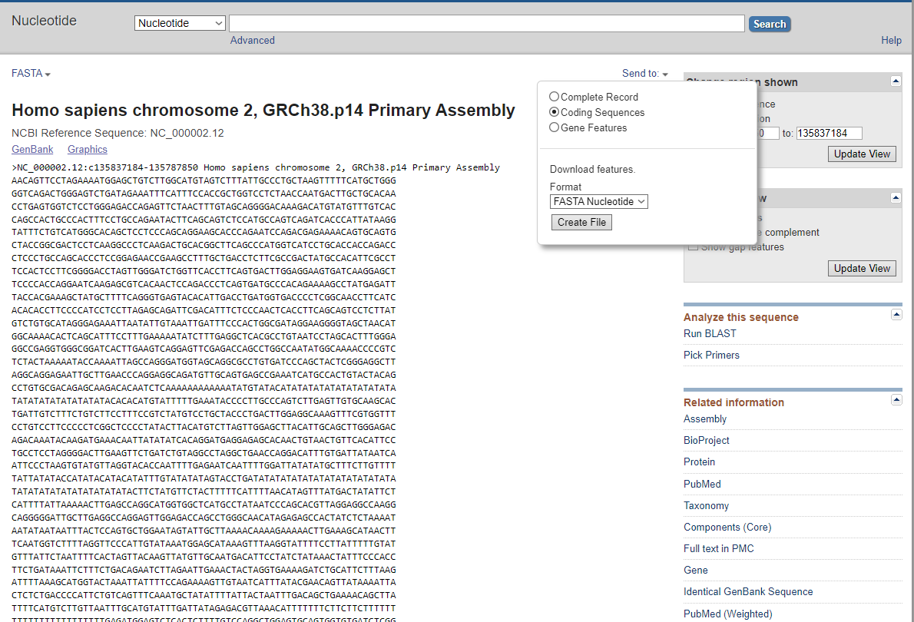

# Ejercicio1

# Descargar una secuencia de ADN del NCBI

En este ejercicio vamos a descargar una secuencia de ADN de la base de datos del NCBI.

## Paso 1: Acceder a la base de datos del NCBI

Para acceder a la base de datos del NCBI, vamos a utilizar el siguiente enlace: [NCBI](https://www.ncbi.nlm.nih.gov/).

{thumbnail="true"}

## Paso 2: Buscar la secuencia de ADN

Una vez en la página del NCBI, vamos a utilizar el cuadro de búsqueda para buscar la secuencia de ADN que queremos descargar. Podemos utilizar un término de búsqueda como el nombre de un gen, una proteína o cualquier otra secuencia de interés.

{thumbnail="true"}

Ya en esta pestaña, vamos a buscar el apartado de `Genomic Regions, transcripts, and products` y seleccionamos la opción de `FASTA` en el apartado de **Go to nucleotide**.

{thumbnail="true" style="display:block"}

## Paso 3: Descargar la secuencia de ADN

Una vez que hemos seleccionado la opción de `FASTA`, vamos a ver la secuencia de ADN en formato FASTA. Para descargar la secuencia, vamos a hacer clic en el botón de `Send to` y seleccionamos la opción de `File` para descargar la secuencia en un archivo de texto.

{thumbnail="true"}

Una vez hecho esto tendremos descargada la secuencia de ADN en un archivo de texto que podemos utilizar para análisis posteriores.

## Conclusión

En este ejercicio hemos aprendido a descargar una secuencia de ADN de la base de datos del NCBI. Este es un paso fundamental para poder analizar secuencias de ADN y realizar investigaciones en bioinformatica.
<tip>
Para los que no tienen conocimiento de muchos genes de importancia aquí se listan algunos ejemplos:

- BRCA1
- BRCA2
- APOE
- HTT
- PRNP
- FANCA
- LAC
</tip>