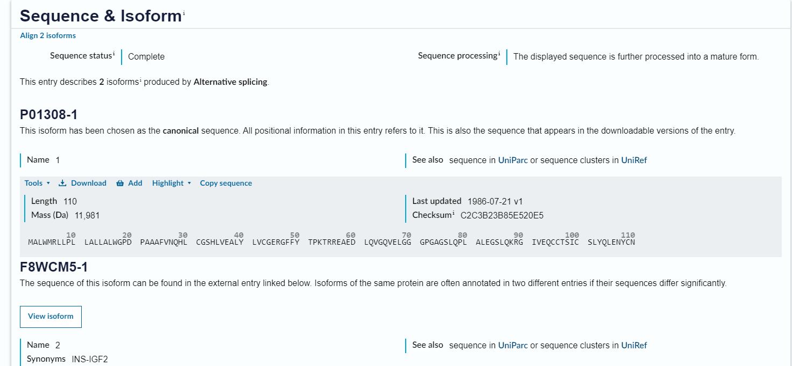

# Ejercicio2

## Obtener una Secuencia de Proteína de UniProt.

UniProt es una base de datos de secuencias de proteínas que contiene información sobre la función de las proteínas, su localización subcelular, su interacción con otras proteínas y su papel en enfermedades.

### Paso 1: Acceder a la base de datos de UniProt

Para acceder a la base de datos de UniProt, vamos a utilizar el siguiente enlace: [UniProt](https://www.uniprot.org/).

{thumbnail="true"}

Después de acceder a la página de UniProt, vamos a utilizar el cuadro de búsqueda para buscar la proteína de interés. Podemos utilizar un término de búsqueda como el nombre de la proteína, el gen que la codifica o cualquier otra información relevante.

<tip>
Para los que no tienen conocimiento de muchas proteínas de importancia aquí se listan algunos ejemplos:

- Insulina
- Hemoglobina
- Colágeno
- Miosina
- Actina
- Tubulina
- Lactasa
- Melanina
- Amilasa
- Queratina
</tip>

### Paso 2: Buscar la secuencia de proteína

Una vez encontrada la proteína de interés, vamos a seleccionarla para ver la información detallada. En la página de la proteína, vamos a buscar la sección de `Sequence` y seleccionamos la opción de `FASTA` para ver la secuencia de proteína en formato FASTA.

{thumbnail="true"}

Ya seleccionada la proteína de interes accedemos al registro de esta y buscamos la sección de `Sequence and Isoforms` 

<note>
Una Isoforma es una proteina con una función similar a otra pero con una secuencia de aminoácidos diferente.
</note>

{thumbnail="true"}

### Paso 3: Descargar la secuencia de proteína

Una vez encontrada la secuencia de la proteína, vamos a dar click derecho en el botón que dice `Download` y seleccionamos la opción de `Save linked content as...` para descargar la secuencia en un archivo de texto.

{thumbnail="true"}

Después de hacer esto, tendremos descargada la secuencia de proteína en un archivo de texto que podemos utilizar para análisis posteriores.

### Conclusión

En este ejercicio hemos aprendido a obtener una secuencia de proteína de la base de datos de UniProt. Este es un paso fundamental para poder analizar proteínas y realizar investigaciones en bioinformática.
