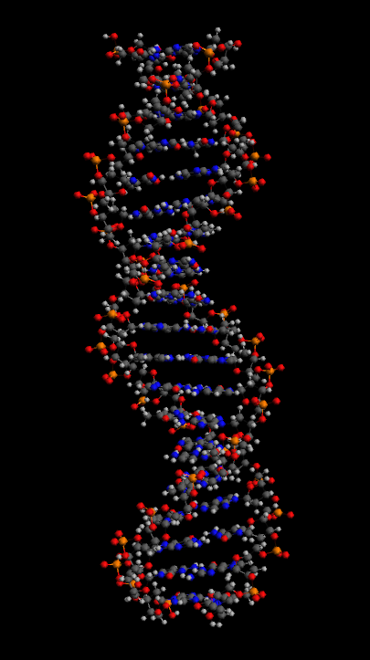
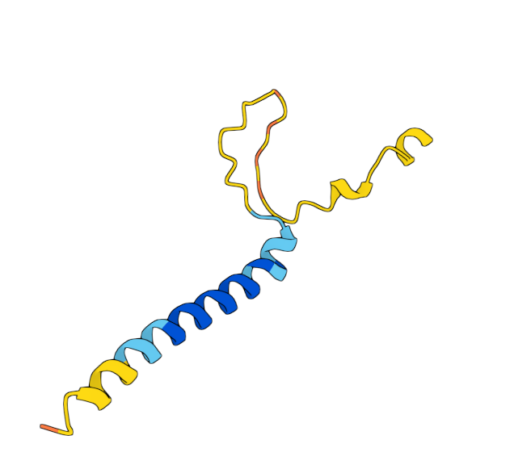
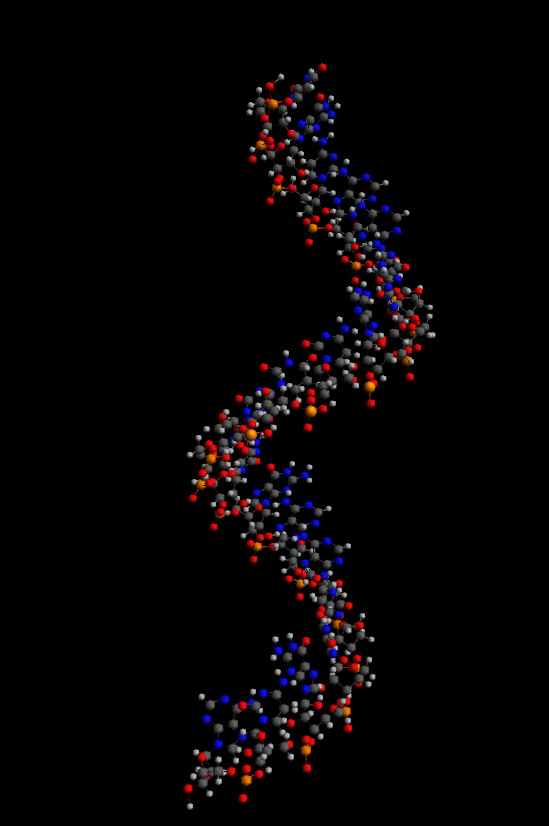

# Ejercicio de Tarea 1

## Objetivo

El objetivo de este ejercicio es que el estudiante sea capaz de identificar las diferencias y similitudes entre las secuencias de ADN, ARN y proteínas, esto basado en las características de cada tipo de secuencia y su función en los organismos.

### Ejercicio 1

Identifica las siguientes secuencias como ADN, ARN o proteína:


1.
```
>gnl|SRA|SRR29006270.1.1C00127:115:HG3HUBCX2:2:1102:1638:1974
GUUGAUAGUUGAAAAUUUACAUGAAA
```
2.
```
>HTT-201
MATLEKLMKAFESLKSFQQQQQQQQQQ
```
3.
```
>HTT-201 ENSE00001251499
GCTGCCGGGACGGGTCCAAGATGGACGG
```

### Ejercicio 2

Identifica las siguientes imágenes como ADN, ARN o proteína:

1. 
   {thumbnail="true"}

2.
    {thumbnail="true"}

3.
    {thumbnail="true"}

### Ejercicio 3

Responder a las siguientes preguntas:

1. ¿Cuál es la función principal del ADN en los organismos?

2. ¿Cuál es la función principal del ARN en los organismos?

3. ¿Cuál es la función principal de las proteínas en los organismos?

4. ¿Cuál es la relación entre el ADN, ARN y las proteínas en los organismos?

5. ¿Qué tipo de información genética se almacena en el ADN?

6. ¿Qué características estructurales diferencian al ADN, ARN y las proteínas?

7. ¿Qué diferencia hay entre genoma, transcriptoma y proteoma?

8. Describe que significan las siguientes siglas: mRNA, tRNA, cDNA, DNA.

9. ¿Qué es la transcripción y la traducción en los organismos?

10. ¿Qué es la expresión génica y cómo se relaciona con el ADN, ARN y las proteínas?

### Conclusión

En este ejercicio hemos aprendido a identificar las diferencias y similitudes entre las secuencias de ADN, ARN y proteínas