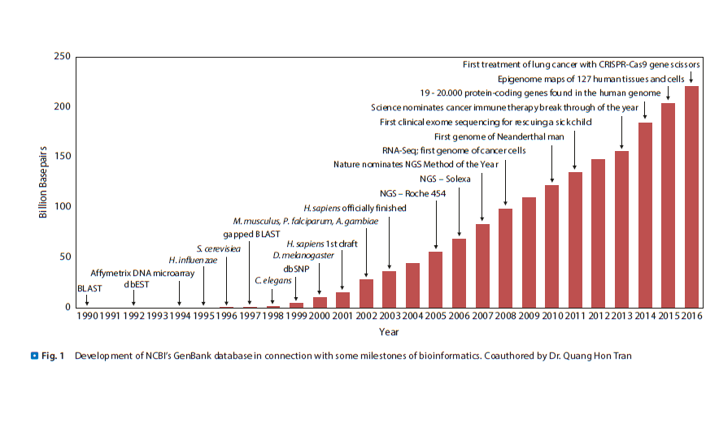

# Introducción a la Bioinformatica

La bioinformatica es una disciplina que se encarga de la aplicación de la informática, la estadística y las matemáticas hacia la biología y la medicina. La bioinformatica se encarga de la gestión y análisis de datos biológicos, como secuencias de ADN, proteínas, metabolitos, etc.

El primer algoritmo para poder comparar secuencias de proteínas fue publicado en 1970 por Needleman y Wunsch[1] y con el la bioinformatica nació.
Este algoritmo fue publicado incluso un año antes de que existiera el primer precursor del internet, ARPANET. Sin embargo, el término bioinformatica no se acuñó hasta 1978 por Paulien Hogeweg y Ben Hesper en un artículo publicado en holandés[2].

El Brookhaven Protein Data Bank(PDB) fue creado en 1971. El PDB es el primer banco de datos de proteínas y empezó como una base de datos de estructuras cristalográficas de proteínas. El desarrollo de la bioinformatica avanzó de manera lenta al principio, hasta que en 1977 se publicó la primer secuencia genética completa del bacteriófago `ϕX174` por Sanger y colaboradores[3].
A partir de ese momento, la bioinformatica ha avanzado a pasos agigantados y ha sido una de las disciplinas que más ha crecido en los últimos años.

Como lo es la publicación de la Reacción en Cadena de la Polimerasa(PCR) por Mullis y sus colegas en 1986[4] la cual representó un hito en la historia de la biología molecular y la bioinformatica. La PCR permitió la amplificación de secuencias de ADN de manera exponencial y fue un avance que revolucionó la biología molecular y la bioinformatica.
En ese mismo año la base de datos SWISS-PROT fue creada por Amos Bairoch y colaboradores, esta fue la primera base de datos de secuencias de proteínas más importante en bioinformatica por muchos años.

Consecuentemente, dos años después, en 1988, se fundó el National Center for Biotechnology Information (NCBI) en los Estados Unidos[5]. El NCBI es una de las instituciones más importantes en bioinformatica y es la institución que alberga a Genbank, la base de datos de secuencias genéticas más grande del mundo.
También en 1988, se da inicio al proyecto Genoma Humano[6] y la publicación del algoritmo FASTA por Pearson y Lipman[7], en el transcurso de ese año Kuska y colaboradores acuñaron el término de genómica[8]

Mas delante en 2005, fue creada la plataforma 454 de Roche que seria conocida como la primera plataforma de secuenciación de nueva generación lanzada al mercado. Esta plataforma permitió la secuenciación masiva de genomas y fue un hito en la historia de la bioinformatica.[9]
Tres años después, en 2008, se publicó el proceso de RNA-Seq, el cual permitió un análisis más profundo de la expresión génica profundizando el area de la bioinformatica, abriendo la puerta a nuevas disciplinas como la transcriptómica, la proteómica y la farmacogenómica.[10] 

{thumbnail="true"}{ width=450 height=300}

Figura 1. Evolución de la bioinformatica

## Referencias

<tip>

[1] S. B. Needleman and C. D. Wunsch, ‘A general method applicable to the search for similarities in the amino acid sequence of two proteins’, Journal of Molecular Biology, vol. 48, no. 3, pp. 443–453, Mar. 1970, doi: 10.1016/0022-2836(70)90057-4.

[2] P. Hogeweg and B. Hesper, ‘Interactive instruction on population interactions’, Computers in Biology and Medicine, vol. 8, no. 4, pp. 319–327, Jan. 1978, doi: 10.1016/0010-4825(78)90032-X.

[3] F. Sanger et al., ‘Nucleotide sequence of bacteriophage φX174 DNA’, Nature, vol. 265, no. 5596, pp. 687–695, Feb. 1977, doi: 10.1038/265687a0.

[4] K. Mullis, F. Faloona, S. Scharf, R. Saiki, G. Horn, and H. Erlich, ‘Specific Enzymatic Amplification of DNA In Vitro: The Polymerase Chain Reaction’, Cold Spring Harbor Symposia on Quantitative Biology, vol. 51, no. 0, pp. 263–273, Jan. 1986, doi: 10.1101/SQB.1986.051.01.032.

[5] E. W. Sayers et al., ‘Database resources of the national center for biotechnology information’, Nucleic Acids Research, vol. 50, no. D1, pp. D20–D26, Jan. 2022, doi: 10.1093/nar/gkab1112.

[6] F. S. Collins and L. Fink, ‘The Human Genome Project’, Alcohol Health Res World, vol. 19, no. 3, pp. 190–195, 1995.

[7] W. R. Pearson and D. J. Lipman, ‘Improved tools for biological sequence comparison.’, Proc. Natl. Acad. Sci. U.S.A., vol. 85, no. 8, pp. 2444–2448, Apr. 1988, doi: 10.1073/pnas.85.8.2444.

[8] B. Kuska, ‘Beer, Bethesda, and Biology: How “Genomics” Came Into Being’, JNCI: Journal of the National Cancer Institute, vol. 90, no. 2, pp. 93–93, Jan. 1998, doi: 10.1093/jnci/90.2.93.

[9] M. Totty, “A better idea,” WSJ.com. https://web.archive.org/web/20150930102312/http://www.wsj.com/public/article/SB112975757605373586-Z9c37xOR0aRxcPzd_hkq9fcF8Ls_20061024.html

[10] Z. Wang, M. Gerstein, and M. Snyder, ‘RNA-Seq: a revolutionary tool for transcriptomics’, Nat Rev Genet, vol. 10, no. 1, pp. 57–63, Jan. 2009, doi: 10.1038/nrg2484.

</tip>
